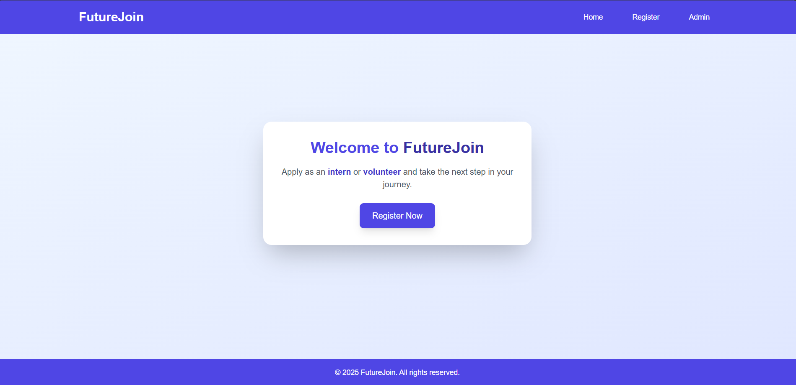
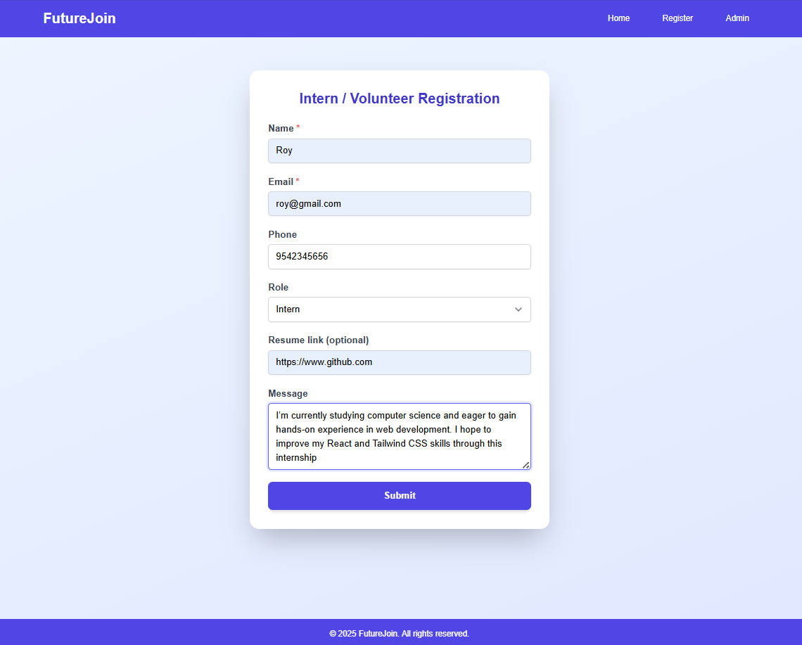
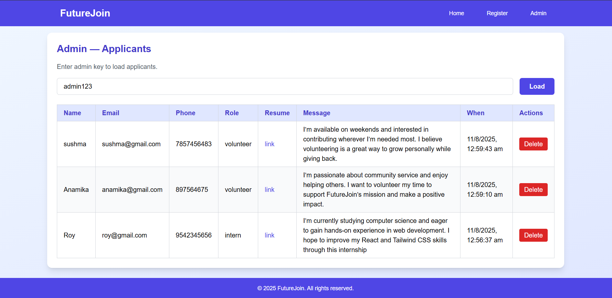
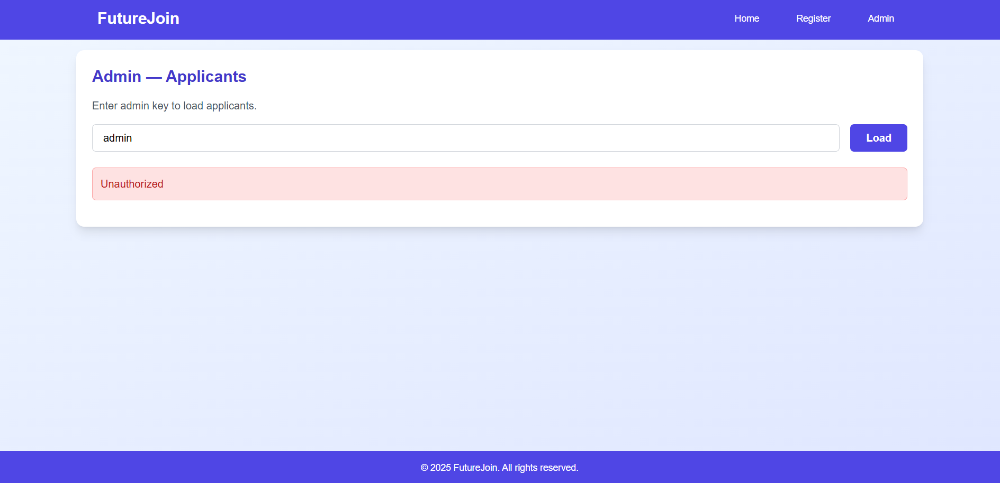

# **FutureJoin**

**FutureJoin** is a MERN-based platform that connects interns and volunteers with opportunities. Applicants can easily register and share details, while admins securely review and manage submissions in real time—streamlining recruitment for impactful careers and community work. 

**Features**

>Home Page with clear navigation.

>Applicant Registration Form for interns and volunteers.

>Admin Dashboard (protected by admin key) to view/manage applicants.

**Tech Stack**

>MongoDB – database for storing applicants.

>Express.js – backend server framework.

>React.js – frontend user interface.

>Node.js – backend runtime environment.

### **Quick Start**

**Backend**

>cd backend  

>.env # set MONGO_URI and ADMIN_KEY 

>npm install

> npm run dev

**Frontend**

>cd frontend 

>.env # set REACT_APP_API_URL 

>npm install 

>npm start

**Database**

>download mongodb

>create a connection with name "internsdb"

**short cut**
>Download the zip file

>Extract the downloaded file

>create a connection with name **"internsdb"**

>Go to the backend folder then open in terminal
>and run the commend **"npm run dev"**

>Go to the frontend folder then open in terminal
>and run the commend **"npm start"**

Backend runs on http://localhost:5000  
Frontend on http://localhost:3000 by default.

ADMIN_KEY = **"admin123"**

### **Screenshort**
**Home Page**

**RegisterPage**

**Admin Page**

**Error Page**

**Security Note**

>The admin view uses a simple x-admin-key header for authentication. For production, implement secure authentication (e.g., JWTs, role-based access).

**License**

>Open for personal and educational use.
